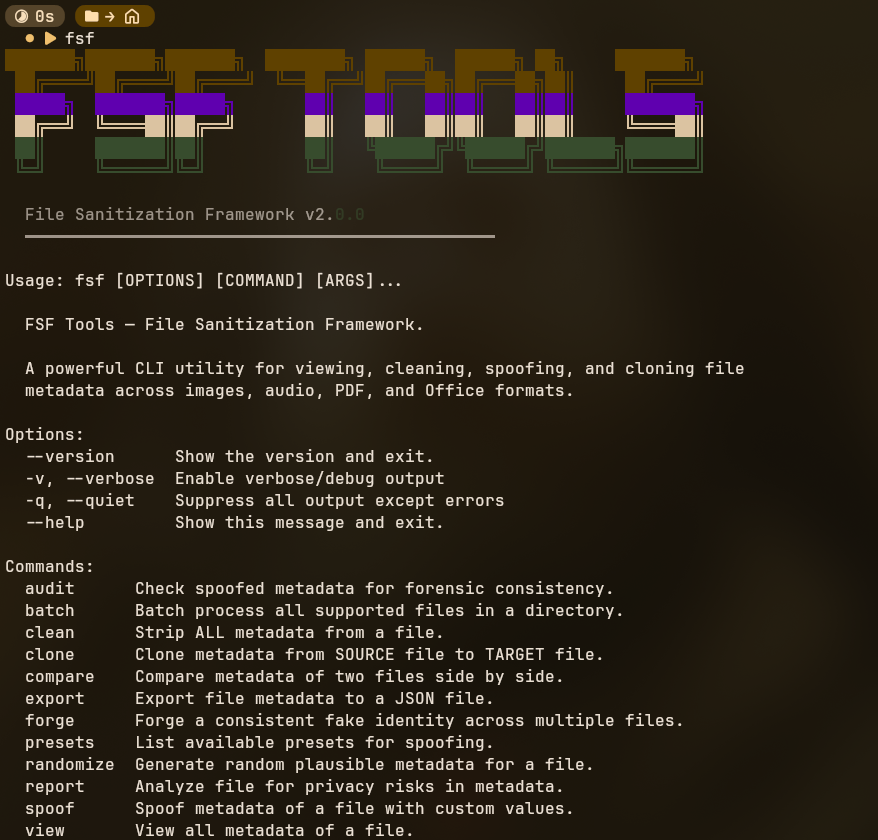

<div align="center">

# 🛡️ FSF Tools — Руководство пользователя (RU)

**File Sanitization Framework v2.0.0** — швейцарский нож для работы с метаданными файлов.

[English README](README.md) • [Репозиторий GitHub](https://github.com/Svargentyur/fsf-tools)

<br />



</div>

---

## 📖 Оглавление

1. [Особенности и отличие от аналогов](#features)
2. [Быстрая установка](#install)
3. [Поддерживаемые форматы](#formats)
4. [Подробный разбор команд](#commands)
   - [Просмотр метаданных (`fsf view`)](#cmd-view)
   - [Очистка метаданных (`fsf clean`)](#cmd-clean)
   - [Ручная подмена (`fsf spoof`)](#cmd-spoof)
   - [Реалистичная случайная подмена (`fsf randomize`)](#cmd-randomize)
   - [Создание фейковой личности (`fsf forge`)](#cmd-forge)
   - [Криминалистическая проверка (`fsf audit`)](#cmd-audit)
   - [Сравнение файлов (`fsf compare`)](#cmd-compare)
   - [Пакетная обработка (`fsf batch`)](#cmd-batch)
   - [Анализ рисков приватности (`fsf report`)](#cmd-report)
   - [Просмотр пресетов (`fsf presets`)](#cmd-presets)
   - [Экспорт в JSON (`fsf export`)](#cmd-export)
   - [Копирование метаданных (`fsf clone`)](#cmd-clone)
5. [Пресеты камер, городов и сцен](#presets)
6. [Разработка и тесты](#dev)

---

<a id="features"></a>
## ✨ Особенности и отличие от аналогов

| Возможность | FSF Tools 🛡️ | ExifTool 📸 | MAT2 🧹 |
| :--- | :---: | :---: | :---: |
| **Основная философия** | **Генерация правдоподобных фейков** | Чтение/запись тегов вручную | Полное удаление всего |
| **Требования к знаниям** | **Автоматизировано (пресеты/профили)** | Нужны глубокие знания тегов | Не нужны (просто стирает) |
| **Физическая корреляция** | **Да (связь ISO, выдержки и диафрагмы)** | Нет | Н/А |
| **Подделка личности (`forge`)** | **Да (серии фото от одного человека)** | Нет | Нет |
| **Forensic Audit** | **Встроенный детектор аномалий** | Нет | Нет |
| **Синхронизация штампов времени** | **Да (`--sync-time`)** | Требует сложных скриптов | Нет |

---

<a id="install"></a>
## 🚀 Быстрая установка

### Способ 1: Прямо с GitHub через pip

```bash
pip install git+https://github.com/Svargentyur/fsf-tools.git
```

### Способ 2: Клонирование и локальная установка

```bash
git clone https://github.com/Svargentyur/fsf-tools.git
cd fsf-tools
python -m venv .venv
source .venv/bin/activate
pip install -e .
```

Проверка установки:
```bash
fsf --version
```

---

<a id="formats"></a>
## 📁 Поддерживаемые форматы

- **Изображения**: JPEG (`.jpg`, `.jpeg`), PNG (`.png`), TIFF (`.tiff`, `.tif`), WebP (`.webp`)
- **Аудио**: MP3 (`.mp3`), FLAC (`.flac`), OGG (`.ogg`), M4A (`.m4a`)
- **Документы PDF**: PDF (`.pdf`)
- **Офисные документы**: Word (`.docx`), Excel (`.xlsx`), PowerPoint (`.pptx`)

---

<a id="commands"></a>
## 📋 Подробный разбор команд

<a id="cmd-view"></a>
### 1. `fsf view` — Просмотр метаданных
Отображает все найденные EXIF, ID3, PDF и DocumentInfo метаданные в виде красивой таблицы.

```bash
fsf view photo.jpg
fsf view --json document.pdf
```

<a id="cmd-clean"></a>
### 2. `fsf clean` — Полная очистка
Удаляет ВСЕ метаданные из файла (EXIF, GPS, имя автора, программное обеспечение).

```bash
# Перезаписать файл:
fsf clean photo.jpg

# Сохранить очищенную копию:
fsf clean photo.jpg -o clean_photo.jpg
```

<a id="cmd-spoof"></a>
### 3. `fsf spoof` — Ручная подмена
Позволяет вручную задать конкретную камеру, город, автора или дату.

```bash
# Для фотографий:
fsf spoof photo.jpg --preset iphone_15_pro --city tokyo --sync-time

# Для документов PDF / Word:
fsf spoof doc.docx --author "Иван Иванов" --title "Открытый отчет"
```

<a id="cmd-randomize"></a>
### 4. `fsf randomize` — Реалистичная подмена
Генерирует физически корректные метаданные с учетом треугольника экспозиции (ISO ↔ Выдержка ↔ Диафрагма).

```bash
# Случайная камера и GPS:
fsf randomize photo.jpg

# Ночная съемка в Токио на Sony A7IV:
fsf randomize photo.jpg --scene night_street --city tokyo --preset sony_a7iv --sync-time
```

<a id="cmd-forge"></a>
### 5. `fsf forge` — Создание фейковой личности
Генерирует консистентную персону (имя, камера, домашний город, стиль) и применяет её к серии файлов. Выглядит так, словно все снимки сделаны одним человеком в ходе поездки.

```bash
# Создать японский профиль фотографа в Киото:
fsf forge *.jpg --locale jp --city kyoto --camera fuji_xt5 -o ./output/
```

Доступные локали имен: `en` (США/Англия), `de` (Германия), `jp` (Япония), `es` (Испания), `ru` (Россия), `kr` (Корея).

<a id="cmd-audit"></a>
### 6. `fsf audit` — Криминалистическая проверка
Проверяет файл на аномалии, которые могут выявить криминалистические инструменты (несоответствие даты файла и EXIF, нереалистичная экспозиция, несовпадение разрешения матрицы и файла).

```bash
fsf audit photo.jpg
fsf audit --json photo.jpg
```

<a id="cmd-compare"></a>
### 7. `fsf compare` — Сравнение двух файлов
Показывает side-by-side сравнение метаданных двух файлов с индикацией совпадений (`=`) и различий (`≠`).

```bash
fsf compare original.jpg spoofed.jpg
```

<a id="cmd-batch"></a>
### 8. `fsf batch` — Пакетная обработка
Очистка или случайная подмена метаданных для всей папки.

```bash
# Очистить всю папку рекурсивно:
fsf batch ./photos/ --action clean -r

# Случайная рандомизация под пресет iPhone 15 Pro:
fsf batch ./photos/ --action randomize --preset iphone_15_pro -o ./clean_photos/
```

<a id="cmd-report"></a>
### 9. `fsf report` — Анализ рисков приватности
Оценивает уровень опасности метаданных (наличие точных координат GPS, серийного номера, имени автора) по шкале от 0 до 100.

```bash
fsf report photo.jpg
```

<a id="cmd-presets"></a>
### 10. `fsf presets` — Список пресетов
Выводит доступные камеры и города с GPS координатами и точками интереса.

```bash
fsf presets --cameras
fsf presets --cities
```

<a id="cmd-export"></a>
### 11. `fsf export` — Экспорт метаданных
Сохраняет всю структуру метаданных файла в JSON-файл.

```bash
fsf export photo.jpg -o metadata.json
```

<a id="cmd-clone"></a>
### 12. `fsf clone` — Копирование метаданных
Копирует метаданные из исходного файла в целевой.

```bash
fsf clone source.jpg target.jpg -o output.jpg
```

---

<a id="presets"></a>
## 🎨 Пресеты камер, городов и сцен

### Поддерживаемые камеры (18 пресетов):
- **Apple**: iPhone 15 Pro, iPhone 14
- **Samsung**: Galaxy S24 Ultra, Galaxy S23
- **Google**: Pixel 8 Pro, Pixel 7
- **Sony**: Alpha 7 IV, Alpha 7R V
- **Canon**: EOS R5, EOS R6 Mark II
- **Nikon**: Z8, Z6 III
- **Fujifilm**: X-T5, X-H2
- **Leica**: Q3
- **Ricoh**: GR III
- **GoPro**: HERO12 Black
- **DJI**: Mavic 3 Pro

### Сцены съемки (`--scene`):
- `daylight_outdoor` — яркий дневной свет (низкое ISO, высокая выдержка)
- `golden_hour` — закатный/рассветный свет (теплый свет, светосильная оптика)
- `indoor` — помещениие (среднее ISO, выдержка 1/60s)
- `night_street` — ночной город (высокое ISO 3200-6400, открытая диафрагма)
- `portrait` — портрет (боке, диафрагма f/1.4-f/2.8)
- `landscape` — пейзаж (зажатая диафрагма f/8-f/11, ISO 100)

---

<a id="dev"></a>
## 🧪 Разработка и тесты

Запуск полного тестового набора (27 тестов):

```bash
pytest tests/ -v
```

---

## 📝 Лицензия

Проект распространяется под открытой лицензией [MIT](LICENSE).
